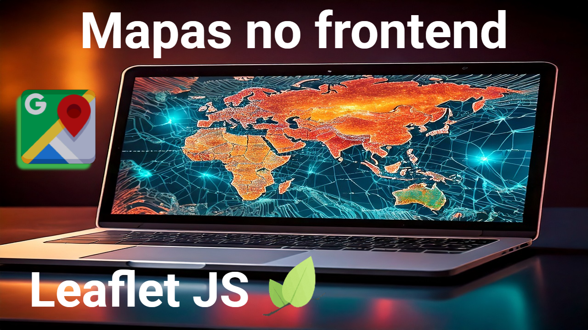

# Plotando uma mapa no seu projeto frontend

About
Repositório do projeto criado em vídeo no meu canal onde conhecemos o LeafletJS, uma biblioteca open source para plot de mapas, uma alternativa ao google maps: [Vídeo](https://youtu.be/3UVKQZZ1XBc)



## Descrição Vídeo

Nesse vídeo vamos conhecer uma biblioteca que pode funcionar como alternativa ao google maps
para plotar mapas nos projetos frontend. Configuramos no vídeo o leaflet em um projeto angular.

## Clonar o projeto

Clone o repositório

```bash
git clone https://github.com/lucasspeixoto/angular-geolocation-tutorial.git
```

## Execute

```bash
# entre na pasta
cd angular-geolocation-tutorial

# instale as dependências
npm install

# rode o projeto
npm start
```

## Se inscreva no meu canal

O [Descomplicando a prática](https://www.youtube.com/channel/UC6LY6Xw5ff_KaHwjHWRA9oA?sub_confirmation=1) tem conteúdo para quem está começando e muito para quem quer elevar o nível e se aprofundar em diversos temas. Falamos de Angular, React, Spring Boot, Javascript, Typescript e Java. 🎯

Quer elevar seu nível e se destacar onde estiver ? Se inscreva no canal e vamos embarcar nessa juntos 🚀.

## License

[MIT](https://choosealicense.com/licenses/mit/)
